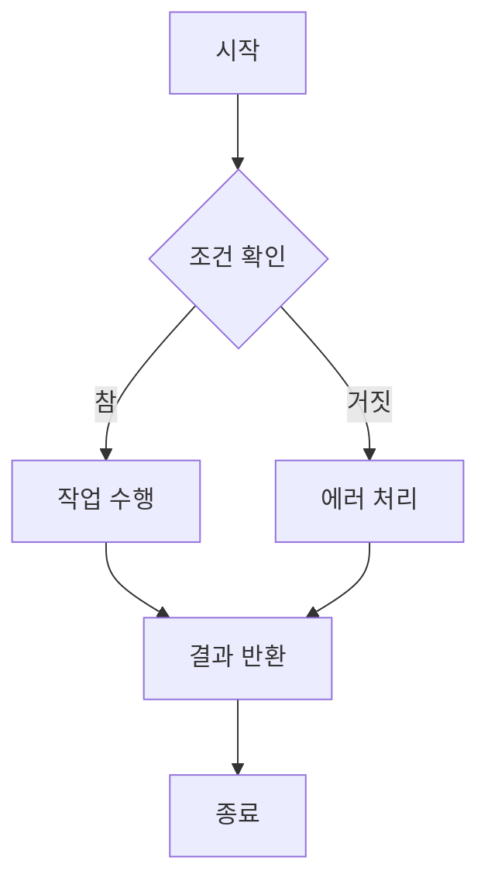
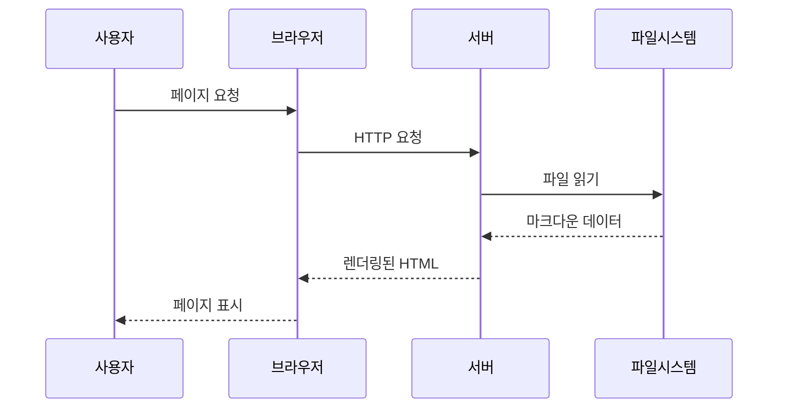

# 📖 스텝별 튜토리얼

마크다운 뷰어를 처음 사용하시나요? 이 튜토리얼을 통해 기본부터 고급 기능까지 차근차근 배워보세요!

## 🏁 시작하기 전에

### 필요한 것들
- [x] Node.js 18+ 설치
- [x] 코드 에디터 (VS Code 권장)
- [x] 기본적인 마크다운 문법 지식
- [x] Git 기본 사용법

### 프로젝트 클론하기

```bash
# 프로젝트 복제
git clone <repository-url>
cd markdown-viewer

# 의존성 설치
npm install

# 개발 서버 시작
npm run dev
```

서버가 시작되면 http://localhost:3000에서 확인할 수 있습니다.

## 📝 Step 1: 첫 번째 마크다운 파일 만들기

### 1.1 파일 생성

`content` 폴더에 새로운 `.md` 파일을 만들어보세요:

```bash
# content 폴더로 이동
cd content

# 새 파일 생성
touch my-first-post.md
```

### 1.2 Frontmatter 작성

파일 상단에 메타데이터를 추가합니다:

```markdown
---
title: "나의 첫 번째 포스트"
description: "마크다운 뷰어로 만든 첫 번째 문서입니다."
code: "first-post"
---

# 안녕하세요! 👋

이것은 저의 첫 번째 마크다운 문서입니다.

## 오늘 배운 것들

- [x] Frontmatter 작성법
- [x] 기본 마크다운 문법
- [ ] 고급 기능들
```

### 1.3 결과 확인

1. 홈페이지(/)에서 새 파일이 나타나는지 확인
2. 카드를 클릭하여 `/view/first-post`로 이동
3. 문서가 올바르게 렌더링되는지 확인

## 🎨 Step 2: 마크다운 문법 마스터하기

### 2.1 기본 텍스트 포맷팅

```markdown
# 제목 1
## 제목 2
### 제목 3

**굵은 글씨**
*기울임 글씨*
~~취소선~~
`인라인 코드`

> 인용문입니다.
> 여러 줄로 작성할 수 있습니다.
```

### 2.2 목록 만들기

```markdown
## 순서 없는 목록
- 첫 번째 항목
- 두 번째 항목
  - 중첩된 항목
  - 또 다른 중첩 항목

## 순서 있는 목록
1. 첫 번째 단계
2. 두 번째 단계
3. 세 번째 단계

## 체크박스 목록
- [x] 완료된 작업
- [ ] 진행 중인 작업
- [ ] 미완료 작업
```

### 2.3 링크와 이미지

```markdown
## 링크
[Google](https://google.com)
[다른 문서로 이동](/view/guide)

## 이미지


```

### 2.4 표 만들기

```markdown
| 이름 | 나이 | 직업 |
|------|------|------|
| 김철수 | 25 | 개발자 |
| 이영희 | 30 | 디자이너 |
| 박민수 | 28 | 기획자 |
```

## 💻 Step 3: 코드 블록 활용하기

### 3.1 인라인 코드

문장 안에서 `변수명`이나 `함수명()`을 표시할 때 사용합니다.

### 3.2 코드 블록

#### JavaScript 예제

```javascript
// 함수 정의
function greetUser(name) {
  console.log(`안녕하세요, ${name}님!`);
  return `Welcome, ${name}!`;
}

// 함수 호출
const message = greetUser("개발자");

// 비동기 함수
async function fetchData() {
  try {
    const response = await fetch('/api/data');
    const data = await response.json();
    return data;
  } catch (error) {
    console.error('데이터 가져오기 실패:', error);
  }
}
```

#### Python 예제

```python
# 클래스 정의
class Calculator:
    def __init__(self):
        self.result = 0
    
    def add(self, x, y):
        """두 수를 더합니다."""
        self.result = x + y
        return self.result
    
    def multiply(self, x, y):
        """두 수를 곱합니다."""
        self.result = x * y
        return self.result

# 사용 예제
calc = Calculator()
print(f"5 + 3 = {calc.add(5, 3)}")
print(f"4 × 6 = {calc.multiply(4, 6)}")
```

#### CSS 예제

```css
/* 반응형 그리드 레이아웃 */
.container {
  display: grid;
  grid-template-columns: repeat(auto-fit, minmax(300px, 1fr));
  gap: 20px;
  padding: 20px;
}

/* 카드 스타일 */
.card {
  background: white;
  border-radius: 8px;
  box-shadow: 0 2px 10px rgba(0, 0, 0, 0.1);
  padding: 24px;
  transition: transform 0.2s ease;
}

.card:hover {
  transform: translateY(-2px);
  box-shadow: 0 4px 20px rgba(0, 0, 0, 0.15);
}
```

## 🚀 Step 4: 고급 기능 사용하기

### 4.1 수학 공식 (LaTeX)

인라인 수식: \(x = \frac{-b \pm \sqrt{b^2 - 4ac}}{2a}\)

블록 수식:
\[
\int_{-\infty}^{\infty} e^{-x^2} dx = \sqrt{\pi}
\]

### 4.2 다이어그램 (Mermaid)



### 4.3 플로우차트


### 4.4 시퀀스 다이어그램



## 📁 Step 5: 파일 구조 최적화

### 5.1 폴더 구조 권장사항

```
content/
├── tutorials/          # 튜토리얼 모음
│   ├── basic.md
│   ├── advanced.md
│   └── tips.md
├── guides/             # 가이드 문서
│   ├── installation.md
│   ├── configuration.md
│   └── deployment.md
├── api/                # API 문서
│   ├── overview.md
│   ├── reference.md
│   └── examples.md
└── blog/               # 블로그 포스트
    ├── 2024-01-15-release.md
    └── 2024-01-20-update.md
```

### 5.2 파일명 규칙

```bash
# 좋은 예
how-to-install.md          # 케밥 케이스
getting-started-guide.md   # 설명적인 이름
api-reference-v2.md        # 버전 포함

# 피해야 할 예
How To Install.md          # 공백 포함
guide.md                   # 너무 일반적
문서1.md                   # 한글 + 숫자
```

### 5.3 Frontmatter 템플릿

```yaml
---
title: "문서 제목"                    # 필수
description: "문서에 대한 간단한 설명"    # 권장
code: "unique-identifier"           # 필수 (URL용)
date: "2024-01-15"                 # 선택사항
author: "작성자 이름"                 # 선택사항
tags: ["tutorial", "beginner"]     # 선택사항
category: "guides"                 # 선택사항
version: "1.0"                     # 선택사항
---
```

## 🎯 Step 6: SEO 최적화

### 6.1 메타데이터 최적화

```yaml
---
title: "완벽한 SEO를 위한 마크다운 작성법"
description: "검색 엔진 최적화를 고려한 마크다운 문서 작성 방법을 배워보세요. 제목, 설명, 키워드 활용법까지!"
code: "seo-markdown-guide"
author: "SEO 전문가"
tags: ["SEO", "마크다운", "검색최적화", "웹개발"]
category: "advanced"
---
```

### 6.2 구조화된 내용

```markdown
# 메인 제목 (H1) - 페이지당 하나만

## 주요 섹션 (H2)

### 하위 섹션 (H3)

#### 세부 내용 (H4)

- 명확한 계층 구조 유지
- 논리적인 흐름 구성
- 키워드 자연스럽게 포함
```

### 6.3 내부 링크 활용

```markdown
관련 문서들:
- [시작하기 가이드](/view/guide)
- [기능 소개](/view/features)
- [API 문서](/view/api)
- [튜토리얼 모음](/view/tutorial)

외부 참고자료:
- [마크다운 문법 가이드](https://www.markdownguide.org/)
- [GitHub Flavored Markdown](https://github.github.com/gfm/)
```

## 🔧 Step 7: 트러블슈팅

### 7.1 자주 발생하는 문제들

#### 문제: 파일이 목록에 나타나지 않음

**원인:**
- Frontmatter 형식 오류
- 필수 필드(`title`, `code`) 누락
- 파일 권한 문제

**해결책:**
```yaml
# 올바른 Frontmatter 형식
---
title: "제목을 입력하세요"
code: "unique-code"
---
```

#### 문제: 코드 하이라이팅이 안됨

**원인:**
- 언어 명칭 오타
- 지원하지 않는 언어

**해결책:**
```markdown
# 잘못된 예
```javascripts
function test() {}
```

# 올바른 예
```javascript
function test() {}
```

#### 문제: 이미지가 로드되지 않음

**원인:**
- 잘못된 경로
- 파일 권한 문제

**해결책:**
```markdown
# public 폴더 사용


# 외부 URL 사용

```

### 7.2 성능 최적화 팁

```markdown
# 이미지 최적화
- WebP 포맷 사용
- 적절한 크기로 리사이징
- 지연 로딩 활용

# 문서 크기 관리
- 한 문서당 최대 50KB 권장
- 긴 내용은 여러 문서로 분할
- 불필요한 공백 제거
```

## 🎉 완료!

축하합니다! 이제 마크다운 뷰어의 모든 기능을 활용할 수 있습니다.

### 다음 단계

1. **더 많은 문서 작성**: 배운 내용을 활용해 다양한 문서를 만들어보세요
2. **고급 기능 탐색**: API 문서를 참고하여 더 깊이 있는 기능들을 알아보세요
3. **커뮤니티 참여**: 다른 사용자들과 팁을 공유해보세요

### 유용한 리소스

- [마크다운 치트시트](https://www.markdownguide.org/cheat-sheet/)
- [Mermaid 문법 가이드](https://mermaid-js.github.io/mermaid/)
- [Next.js 공식 문서](https://nextjs.org/docs)

---

**즐거운 문서 작성 되세요!** ✨ 